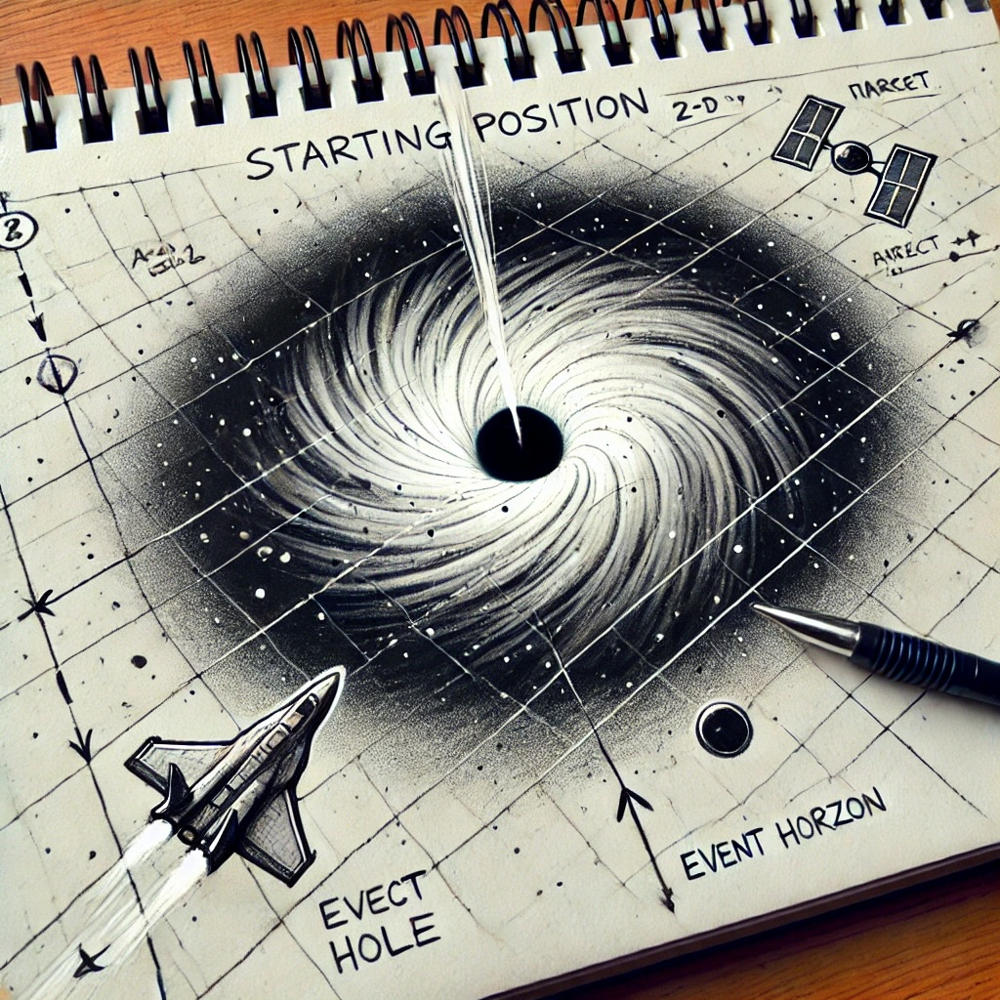

# space-battle-black-hole

<p align="center">
   </img> <br>
   A 2D space battle game around a black Hole ! 🛸

</p>


## Installation 


1. **Clone the Repository**:
   Clone the repository from GitHub:

   ```bash
   git clone https://github.com/atomicwelding/space-battle-black-hole.git
   cd space-battle-black-hole
   ```
   
2. **Install using pip**
   ```bash
   pip3 install .
   ```

3. **Run the game**
   ```bash
   python3 main.py
   ```


   ## Resources

- [Scope statements](rsrc/scope-statements.pdf)


