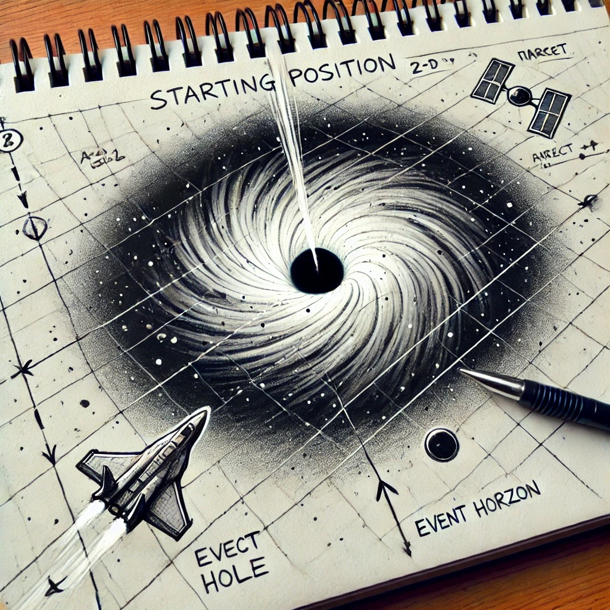

# Conrad

<p align="center">
   </img> <br>
   A 2D space battle game around a black Hole ! 🛸

</p>


## Installation 


1. **Clone the Repository**:
   
   Clone the repository from GitHub:

   ```bash
   git clone https://github.com/atomicwelding/conrad.git
   cd conrad
   ```
   
2. **Install using pip**
   ```bash
   pip3 install .
   ```

3. **Run the game**
   ```bash
   python3 main.py
   ```
   
4. **Extra :** add readline to the console interface.
   
   Download `rlwrap` accordingly to your distribution. Then,
    ```bash
    rlwrap python3 main.py
    ```


   ## Resources

- [Scope statements](resources/scope-statements.pdf)
- [Free assets by AlcWilliam](https://pixel-by-pixel.itch.io/alcwilliam-space-ship-pack)
- [Background image by Screaming Brain Studios](https://screamingbrainstudios.itch.io/seamless-space-backgrounds)
- [rlwrap](https://github.com/hanslub42/rlwrap)


